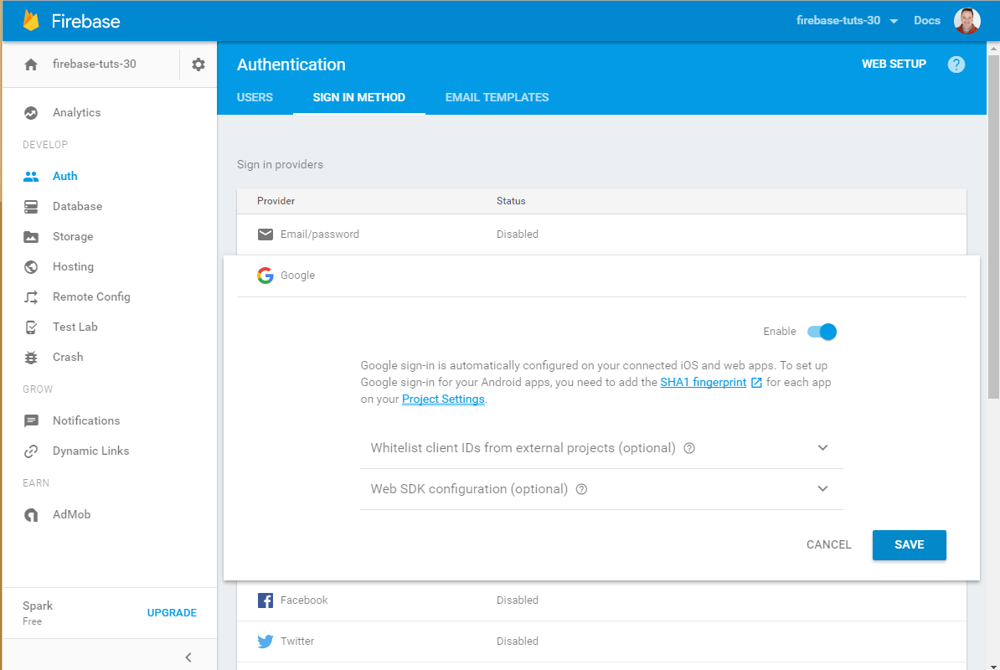

# Authentication

Firebase comes with built-in support for lots of different authentication
methods to help keep data private.

To get setup, follow these steps:

* In the Console, click on Auth on the left
* Click on Sign-in Method

* Click on Google

* Click on enable, and save


This creates all the keys you need on the
[https://console.developers.google.com](https://console.developers.google.com)

## Logging in / out in JS

### Login

To log a user in, you need only a short snippet - no having to deal with OAuth
tokens or redirects, etc;

```javascript
firebase.auth().signInWithPopup(provider).then(function (result) {
  // This gives you a Google Access Token. You can use it to access the Google API.
  // It can be saved in localStorage so you can check it in the future
  var token = result.credential.accessToken;
  // The signed-in user info.
  var user = result.user;
}).catch(function (error) {
  console.error(error);
})
```

### Check if logged in

When a user is logged in or out, you can capture that with
`.onAuthStateChange()`.

It's possible for a user to be logged out while using your application (session
timed out, they deauthorized your application, etc). To detect these changes,
you can use the following:

```javascript
firebase.auth().onAuthStateChanged(function (user) {
  // user is a firebase.User object: https://firebase.google.com/docs/reference/js/firebase.User
  if (user) {
    // User is signed in.
  } else {
    // No user is signed in.
  }
});
```

### Logout

Logging out is similarly as straight forward;

```javascript
firebase.auth().signOut().then(function () {
  // Logged out
}).catch(function (error) {
  // An error happened.
  console.error(error);
});
```

## Data Access

By default, Firebase makes your database access private. Back in part `01`, we
made the access public. Now that we have authenticated users, we can lock down
the access on a per-user basis.

First, we want to [change our
rules](https://firebase.google.com/docs/database/security/user-security) so only the currently authenticated user can see data on their user-id's path (eg `users/ua34HiexlL/`):

When viewing your project, select _Database > Rules >_ [Paste the below code] _>
Publish_

```javascript
{
  "rules": {
    "users": {
      "$user_id": {
        // grants write access to the owner of this user account
        // whose uid must exactly match the key ($user_id)
        ".write": "$user_id === auth.uid"
        ".read": "$user_id === auth.uid"
      }
    }
  }
}
```

You will then need to use the authenticated user's uid in the path for your
database:

```javascript
firebase.auth().onAuthStateChanged(function (user) {
  if (user) {
    let uid = user.uid;
    firebase.database().ref(`users/${uid}/tasks/`).once('value').then(function(snapshot) {
      console.log(snapshot.val());
    });
  }
});
```

Notice that we've restructured out database so all data is stored under
`users/<some-id>/`, which allows the above data access rules to work correctly
(the `users` in our path matches with the `"users"` in our rules).
